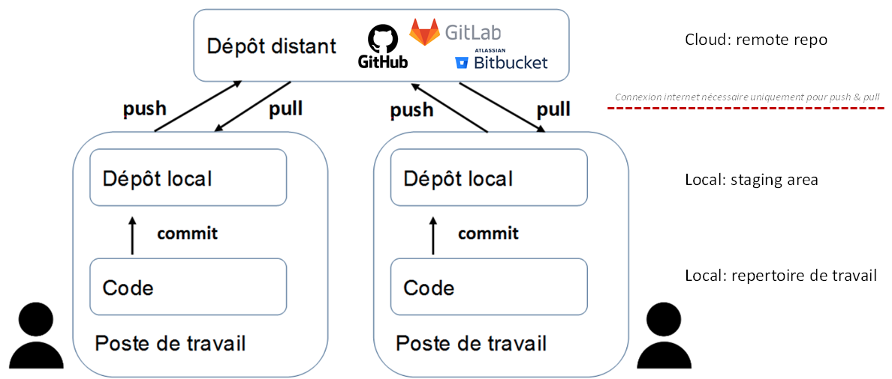
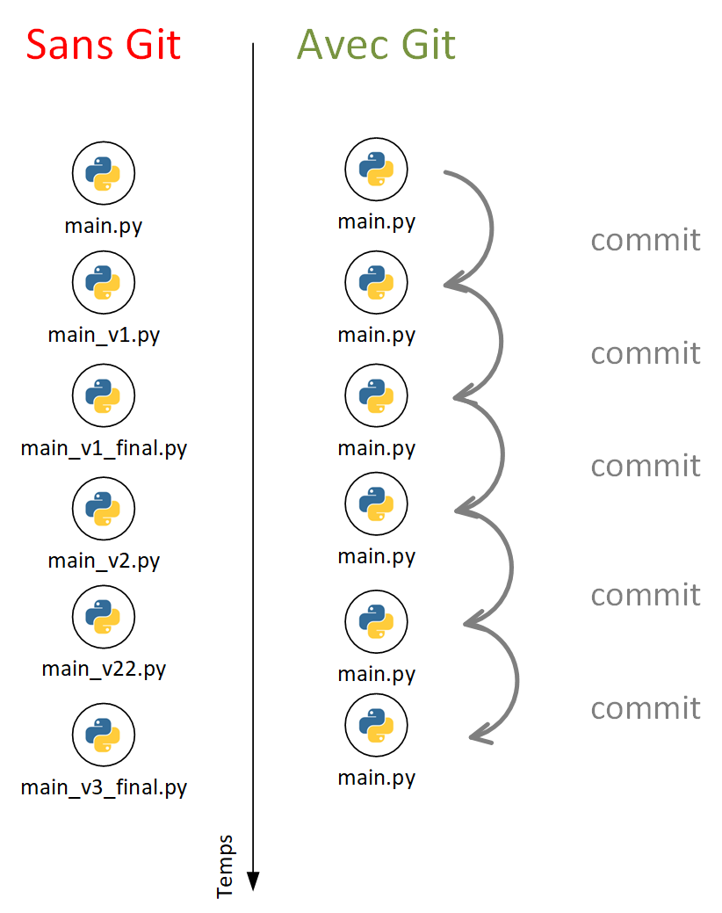
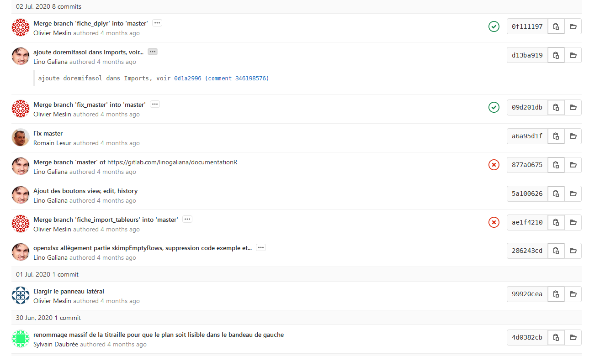

## Pourquoi utiliser Git?

::: columns
::: column

* Multiples versions d’un fichier au cours du temps
* Casse-tête sur le nommage des versions de fichiers:
    * `[date]_[fichier].py`? (ex: `241001_main.py`)
    * `[fichier]_[version].py`? (ex: `main_v0.3.py`)

:::
::: column

:::
:::

* Difficulté à connaitre les évolutions entre fichiers (ex: correction de bug, ajout de fonctionnalité etc.)
* Fichiers avec le même nom en local et dans le cloud (Google Drive, Sharepoint etc.) peuvent être différents
* Travailler en équipe sur le même fichier et gestion des conflits

==> Solution:   `Git`.

* **Logiciel** spécialisé dans le contrôle de version (de loin le plus populaire)
* Utilisé par tous les développeurs, qu’ils travaillent seuls ou en équipe.

*Notes:*

* `Git` est indépendant du langage de programmation, et peut être utilisé pour d’autres finalités: documentation ou tout
  projet avec des évolutions de fichiers.
* `Git` n’est pas `Github` ou `Gitlab` (cf. slide suivant)

---

## `Git` vs `GitHub` vs `Gitlab`

* `Git` est un logiciel:
    - Utilisation en ligne de commandes
    - Interfaces graphiques sur la plupart des outils modernes de développement (`RStudio`, `VS Code`, `Pycharm` etc.)
* `GitHub`, `GitLab`, `Bitbucket` etc. sont des **forges logicielles**.
    - Espace d’archivage de code dans le cloud
    - Fonctions supplémentaires de réseaux sociaux

---

## Principe de fonctionnement



## Principe de fonctionnement

::: columns

::: column
*Évolution du fichier dans le temps:*

{height="500px"}

:::
::: column
*Suivi des modifications sur `GitHub`:*


:::
:::

## Le format `Markdown`

* Language de balisage simpifié permettant de générer du code `html` à partir d'une syntaxe allégée.

::: columns
::: column

- Syntaxe `Markdown`:

```text
# Titre 1
# # Titre 2

paragraphe

* bullet 1
  - sous-bullet 1
  - sous-bullet 2
* bullet 2
```

:::
::: column

- Syntaxe équivalente `HTML`:

```html
<h1>Titre 1</h1>
<h2>Titre 2</h2>

<p>paragraphe</p>

<ul>
    <li>bullet 1
        <ul>
            <li>sous-bullet 1</li>
            <li>sous-bullet 2</li>
        </ul>
    </li>
    <li>bullet 2</li>
</ul>
```

:::
:::

* Language utilisé sur `GitHub` pour la rédaction des fichiers `README.md` et pour les échanges entre contributeurs.
* Permet de générer des pages web de façon rapide et maintenables.
* Utilisé pour la rédaction de ces slides et du cours [Python pour la data science](https://pythonds.linogaliana.fr/).
* [Documentation](https://commonmark.org/help/).

## Markdown Cheatsheet

| Type                                                                              | Or …                                                                            | Get                                                                                       |
|-----------------------------------------------------------------------------------|---------------------------------------------------------------------------------|-------------------------------------------------------------------------------------------|
| `*Italic*`                                                                        | `_Italic_`                                                                      | *Italic*                                                                                  |
| `**Bold**`                                                                        | `__Bold__`                                                                      | **Bold**                                                                                  |
| `# Heading 1`                                                                     | `Heading 1`<br>`=========`                                                      | <h1 style="margin:0">Heading 1</h1>                                                       |
| `## Heading 2`                                                                    | `Heading 2`<br>`---------`                                                      | <h2 style="margin:0">Heading 2</h2>                                                       |
| `[Link](http://a.com)`                                                            | `[Link][1]`<br>`[1]: http://b.org`                                              | <a href="http://a.com">Link</a>                                                           |
| ``                                                      | `![Image][1]`<br>`[1]: http://url/b.jpg`                                        |                                        |
| `> Blockquote`                                                                    |                                                                                 | <blockquote style="margin:0">Blockquote</blockquote>                                      |
| `* List`<br>`* List`<br>`* List`                                                  | `- List`<br>`- List`<br>`- List`                                                | <ul><li>List</li><li>List</li><li>List</li></ul>                                          |
| `1. One`<br>`2. Two`<br>`3. Three`                                                | `1) One`<br>`2) Two`<br>`3) Three`                                              | <ol><li>One</li><li>Two</li><li>Three</li></ol>                                           |
| `horizontal rule` <br> `---`                                                      | `horizontal rule` <br> `***`                                                    | <p>horizontal line</p><hr>                                                                    |
| ``Inline `code` with backticks``                                                  |                                                                                 | Inline `code`                                                                             |
| 	````<br># code block<br>print '3 backticks or'<br>print 'indent 4 spaces'<br>``` | 		····# code block<br>····print '3 backticks or'<br>····print 'indent 4 spaces' | <pre><code># code block<br>print '3 backticks or'<br>print 'indent 4 spaces'</code></pre> |	

## Création de compte `GitHub`

::: columns

::: column

### Création de compte et dépôt

* Se rendre sur `github.com` et créer un compte si pas déjà fait
* Créer un dépôt privé.
* Ajouter un `README.md`
* Ajouter un `.gitignore` (modèle: `Python`)

:::
::: column


:::
:::

---

## Authentification - `GitHub`

* Nécessaire pour contribuer à un dépôt
* Deux types d’authentifications:
    - HTTPS: login et mot de passer ou token généré par GitHub
    - SSH: clé cryptée en local sur le poste de travail
* Aller sur son profil en haut à gauche puis:

> **settings** / menu gauche: **developper settings** / **Personal access tokens**, click **Fine-grained tokens** / *
*Generate new token**.

* Donner un nom au token, période de validité et le copier.<br>


---

## Authentification - `SSP Cloud`

* Ne jamais copier le token dans un fichier texte non crypté! (utiliser [Keepass](https://keepass.fr/) par exemple).
* Aller
  sur [“Mon compte”](https://auth.lab.sspcloud.fr/auth/realms/sspcloud/protocol/openid-connect/auth?client_id=onyxia&redirect_uri=https%3A%2F%2Fdatalab.sspcloud.fr%2F&response_type=code&scope=openid+profile&state=b2lkYy1zcGEulmV5oZr5T_O8qtDJMdYP&code_challenge=k7U-KbYo2h0izIbAQfoJL0XVBNlqdL5W2akZFKeCik0&code_challenge_method=S256&response_mode=fragment&audience=onyxia&ui_locales=en&onyxia-instance-public-url=https%3A%2F%2Fdatalab.sspcloud.fr)
  du `SSPCloud`, onglet **Git**, section **Git Forge Personal Access Token**, **edit** et coller le token.
* Aller
  sur [Mes Services](https://auth.lab.sspcloud.fr/auth/realms/sspcloud/protocol/openid-connect/auth?client_id=onyxia&redirect_uri=https%3A%2F%2Fdatalab.sspcloud.fr%2F&response_type=code&scope=openid+profile&state=b2lkYy1zcGEuOVUrrs-a9IJmQuEQ9Quy&code_challenge=hkJJmj3gX-XcbS2IkDdFUrPsN5dTRYXpYZ-pTYv4S30&code_challenge_method=S256&response_mode=fragment&audience=onyxia&ui_locales=en&onyxia-instance-public-url=https%3A%2F%2Fdatalab.sspcloud.fr) /
  ➕Nouveau service / vscode-python


---

## Clone de repo `Git`

::: columns
::: column

* Sur le Repo `Git`, récupérer l’url du repo.
* Sur le projet `SSPCloud`: Ouvrir le terminal (`☰ / Terminal / New Terminal`) et taper

```shell
git clone https://github.com/<username>/<reponame>.git
```

* Suivre les étapes
* Observer la mise à jour de l’explorateur de fichiers sur `VSCode`, votre `README` et votre `.gitignore` visibles sur
  `Github` doivent maintenant être là.
* Tester l’ajout et la modification de fichiers et répertoires.

:::
::: column


:::
:::

## Les commandes essentielles

| Commande                      | Description                                                                                                                                                        |
|-------------------------------|--------------------------------------------------------------------------------------------------------------------------------------------------------------------|
| `git remote -v`               | Obtention de l’url du repo distant                                                                                                                                 |
| `git add my_file.py`          | Ajout du fichier my_file.py à la staging area                                                                                                                      |
| `git commit –m "commentaire"` | Commit des changements avec commentaire de description des modifications                                                                                           |
| `git pull origin master`      | Récupération de la dernière version du code depuis le repo remote (opération `« fetch »`), et fusion avec changements locaux si nécessaire (opération `« merge »`) |
| `git push origin master`      | Envoi des dernières modifications locales sur le repo remote                                                                                                       |

## Le fichier `.gitignore`

::: columns

::: column

* Permet de lister des répertoires, fichiers, ou types de fichiers à ne pas inclure dans les historiques de versions.
* Exemple:
    - Jeux de données
    - Fichiers de configuration avec mots de passe
    - Fichiers temporaires
    - Librairies externes
    - Etc.

* Syntaxe:
    - `#`:        commentaires
    - `my_file.txt`:    le fichier my_file.txt ne sera pas pris en compte
    - `*.txt`:    aucun fichier texte pris en compte
    - `__pycache__`: aucun fichier dans le répertoire `__pycache__` ne seront pris en compte.

:::
::: column


[Exemple de fichier `.gitignore`]{.legend}
:::
:::

---

## Structurer un projet Python

::: columns
::: column

* Structure minimale:


:::
::: column

* Structure complète:


[source: ChatGPT]{.legend}
:::
:::

## Exercices

1. Enrichir le fichier `.gitignore` en ajoutant les fichiers de type `.csv` et `.pyc` au fichier

2. Modifier un fichier depuis `VSCode` et envoyer sur le repo remote

3. Modifier le fichier `README.md` directement dans `GitHub` et rapatrier les modifications dans `VSCode`

4. Créer une structure de projet minimale sur `VSCode` et envoyer sur le repo remote

## Les branches

::: columns
::: column
Une branche est une version parallèle du projet qui coexiste avec la version principale, sur main. Cela veut dire
qu’avec Git, on peut avoir un même fichier qui coexiste sous plusieurs versions différentes ce qui constitue un terreau
fertile pour l’expérimentation. Une version sera active (la branche active) mais les autres seront disponibles,
activables si besoin

:::
::: column

:::
:::

## Exercices

::: columns
::: column

*
Cf. [cours](https://pythonds.linogaliana.fr/content/git/introgit.html#:~:text=Ouvrir%20une%20issue%20sur%20Github.%20Signaler%20qu%E2%80%99il%20serait%20bien%20d%E2%80%99ajouter%20un%20emoji%20chat%20dans%20le%20README.%20Dans%20la%20partie%20de%20droite%2C%20cliquer%20sur%20la%20petite%20roue%20%C3%A0%20c%C3%B4t%C3%A9%20de%20Label%20et%20cliquer%20sur%20Edit%20Labels.%20Cr%C3%A9er%20un%20label%20Markdown.%20Normalement%2C%20le%20label%20a%20%C3%A9t%C3%A9%20ajout%C3%A9.)

* *Notes:*
    - Créer la banche sur VSCode:

> `Volet source control, en haut à gauche: « … » / Branch / Create Branch`

- Rendre le repo public sur GitHub:

> `Settings / Danger zone / Change visibility`

- Merge branch:
    - `« squash and merge »`: permet de fusionner tous les commit de la branch à merger en un seul
    - Si conflit, résoudre le conflit en local sur la branche, pas sur le main!

:::
::: column


:::
:::

## Gestion des conflits

::: columns
::: column

* Cas simple: ajout par une personne tierce en remote, sans évolutions en local entretemps

> `fast-forward merge`

* Cas plus complexe: modifications simultanées. 2 stratégies:

> `merge`: vérification manuelle des changements ligne par ligne

> `rebase`: 3 étapes:

    1. Supprime temporairement le commit local
    2. Réalise un fast forward merge maintenant que le commit local n’est plus là
    3. Rajoute le commit local au bout de l’historique

* Exercices:
  cf. [cours](https://pythonds.linogaliana.fr/content/git/exogit.html#:~:text=Cet%20exercice%20se%20fait%20par%20groupe%20de%20trois%20ou%20quatre.%20Il%20y%20aura%20deux%20r%C3%B4les%20dans%20ce%20sc%C3%A9nario%20%3A)

:::
::: column


[Cas simple]{.legend}


[Cas `merge`]{.legend}


[Cas `rebase`]{.legend}

:::
:::

## Les commandes de branches

| Commande                    | Description                                                                 |
|-----------------------------|-----------------------------------------------------------------------------|
| `git branch`                | Indique sur quelle branche on travaille                                     |
| `git branch branch_name`    | Crée la nouvelle branche `branch_name`                                      |
| `git checkout branch_name`  | Active la branche `branch_name`                                             |
| `git merge branch_name`     | Fusionne les changements de la branche `branch_name` avec la branche active |
| `git branch –d branch_name` | Efface la branche                                                           |

## Les commandes de projet collaboratif

| Commande                            | Description                                                                  |
|-------------------------------------|------------------------------------------------------------------------------|
| `git clone repo_distant repo_local` | Clone le projet distant `repo_distant` dans le répertoire local `repo_local` |
| `git fetch`                         | Récupère les derniers changements du repo remote                             |
| `git pull origin main`              | Met à jour les modifs dans le repo local                                     |
| `git push origin banch_name`        | Push les modifs de `branch_name` sur le repo distant                         |

---

[TD 04](./04_API_webscrapping.html)
