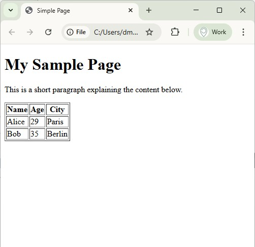
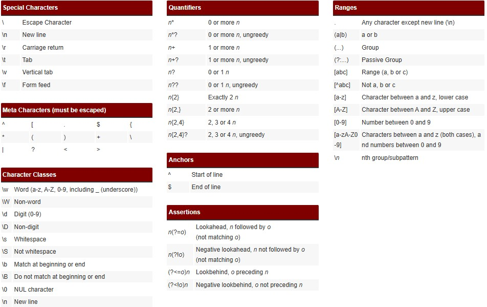

## Intro

* **API**: Application Programming Interface: infrastructure dédiée pour permettre d’accéder à de la donnée de façon programmatique ==> légal, encadré, documenté.
  - Exemples:
    - [API Sirene de l’INSEE](https://www.data.gouv.fr/datasets/base-sirene-des-entreprises-et-de-leurs-etablissements-siren-siret/)
    - [Base adresse nationale de l’IGN (BAN)](https://www.data.gouv.fr/dataservices/api-adresse-base-adresse-nationale-ban/)
    - [API directions de Google Maps](https://developers.google.com/maps/documentation/directions/overview)
    - Etc.
* **Webscrapping**: technique de reproduction de comportements humains (requêtes, copier, coller) pour automatiser un recueil de données.

💡Les API sont à privilégier dès que c’est possible!

## API

* Gratuites ou payantes
* En général, nécessité de création de compte
* Structure habituelle:
  - URL racine de l'API ("root"): (ex: `https://api-adresse.data.gouv.fr`)
  - Point d’entrée pour la tâche demandée ("End point"): (ex: `search`)
  - Clé de requête (en général `?q=`)
  - Paramètres de requête définis dans la documentation de l’API (ex: `5 +Av.+Le+Chatelier&postcode=91120`)
  
Exemple dans la base adresse nationale:

$$
 \underbrace{{https://api-adresse.data.gouv.fr}}_{Point d’entrée (root)}/
 \underbrace{search}_{end point}/
 \underbrace{{?q=}}_{Clé}
 \underbrace{{5 +Av.+Le+Chatelier}}_{Valeurs de requête}
$$


==> Retourne en général un objet `JSON` (ex en slide suivant).

---

## Exemple d'objet `JSON`

```json
[
  {
    "id": 1,
    "name": "Alice",
    "is_active": true,
    "joined": "2020-01-15T09:30:00",
    "skills": ["Python", "SQL", "GIS"],
    "address": {"city": "Paris", "zip": "75001"}
  },
  {
    "id": 2,
    "name": "Bob",
    "is_active": false,
    "joined": "2018-07-23T14:45:00",
    "skills": ["JavaScript", "React"],
    "address": {"city": "Berlin", "zip": "10115"}
  },
  // etc.
]
```

## Application

```python
import requests       # pour lancer une requête web (module natif)
import pandas as pd   # pour stocker et manipuler les données requêtées

# # Exemple avec l’API BAN:
root = 'https://api-adresse.data.gouv.fr/'
endpoint = 'search/'
key = '?q='
address = '8+bd+du+port'

query = f'{root}{endpoint}{key}{address}'

print(query)  
```

1. Copiez coller le résutat de `query` dans la barre url du navigateur et pressez `Entrée`
2. Examinez la structure de la réponse

(suite au slide suivant)

---

3. Chargez le contenu pertinent de la réponse dans un dataframe `pandas` au moyen du code ci-dessous

```python
req = requests.get(query)  # requête web

# # Récupération de l'ensemble de la donnée:
data = req.json()
df2 = pd.DataFrame(data)
df2.head()  # observez le résultat...
```

<br>

```python
df3 = pd.DataFrame(data['features'])
df3.head() # observez le résultat...
```

<br>

```python
# # Lorsque la structure JSON de sortie est emboitée comme ici, utiliser `pd.json_normalize`:
df4 = pd.json_normalize(data['features'])
df4.head() # observez le résultat...
```

---

[Exercice 1](https://pythonds.linogaliana.fr/content/manipulation/04c_API_TP.html#premi%C3%A8re-utilisation-dapi:~:text=Tester%20sans%20aucun%20autre%20param%C3%A8tre%2C%20le%20retour%20de%20notre%20API.%20Transformer%20en%20DataFrame%20le%20r%C3%A9sultat.)

💡Aide

```python
# # Récupérer des coordonnées avec l'API BAN:
import requests

postcode = 92120
url_ban_example = f'https://api-adresse.data.gouv.fr/search/?q={adresse.replace(" ", "+")}&postcode={postcode}'
req = requests.get(url_ban_example)
# req.json()
prop = req.json().get('features')[0].get('properties') 
x, y = prop.get('x'), prop.get('y') 
print(f'x: {x}, y: {y}')

# # Afficher les résultats sur une carte avec `GeoPandas` et `Folium`
import pandas as pd
import geopandas as gpd
import folium

gdf = gpd.GeoDataFrame(data=pd.DataFrame({'ville': ['Montrouge']}), geometry=gpd.points_from_xy([x], [y]), crs='EPSG:2154')
gdf.to_crs(epsg=4326, inplace=True)
gdf['longitude'] = gdf.geometry.x
gdf['latitude'] = gdf.geometry.y

center = gdf[['latitude', 'longitude']].mean().values.tolist()
# sw = gdf[['latitude', 'longitude']].min().values.tolist()
# ne = gdf[['latitude', 'longitude']].max().values.tolist()

m = folium.Map(location = center, tiles='CartoDB.Positron') # CartoDB.Positron, openstreetmap 

# I can add marker one by one on the map
for i in range(0,len(gdf)):
    folium.Marker(
        [gdf.iloc[i]['latitude'], gdf.iloc[i]['longitude']],
        popup=gdf.iloc[i]['ville']
    ).add_to(m)

# m.fit_bounds([sw, ne])
m
```


---

[Exercice 4](https://pythonds.linogaliana.fr/content/manipulation/04c_API_TP.html#:~:text=Trouver%20un%20lieu%20commun%20o%C3%B9%20se%20retrouver%20entre%20amis%20est%20toujours%20l%E2%80%99objet%20d%E2%80%99%C3%A2pres)


## Web scrapping

### Définition

Le web scraping désigne les techniques d’extraction et d'organisation du contenu des sites internet.

### Avertissements

* Toute donnée ne peut être réutilisée à l’insu de la personne à laquelle ces données appartiennent ==> données collectées par web scraping soumises au RGPD et nécessitent donc le consentement des personnes à l'origine de ces données.[^1]

* Les structures de données scrappées peuvent évoluer avec le site dont elles sont issues et rendre votre code inopérant à l'avenir.

[^1]: Directive CNIL 2020.

### Bonne pratiques du webscrapping

* Consulter le fichier `robots.txt` à la racine du site pour vérifier les consignes encadrant le comportement des robots.
* Espacer les requêtes de quelques secondes.
* Effectuer ses requêtes en heures creuses.


## Structure d'une page `HTML`


::: {.columns}
::: {.column width="45%"}
* `HTML` brut:

```html
<!DOCTYPE html>
<html lang="en">
<head>
  <meta charset="UTF-8">
  <title>Simple Page</title>
</head>
<body>
  <h1>My Sample Page</h1>
  <p>This is a short paragraph explaining the content below.</p>
  
  <table border="1">
    <tr>
      <th>Name</th>
      <th>Age</th>
      <th>City</th>
    </tr>
    <tr>
      <td>Alice</td>
      <td>29</td>
      <td>Paris</td>
    </tr>
    <tr>
      <td>Bob</td>
      <td>35</td>
      <td>Berlin</td>
    </tr>
  </table>
</body>
</html>

```
:::
::: {.column width="10%"}


:::
::: {.column width="45%"}
* Rendu:


:::
:::

*Note: * Pour observer la structure d'une page `HTML` depuis votre navigateur: 
> clic droit / afficher le code source de la page (`CTRL + U` sous `Chrome`, `CTRL + MAJ + K` sous `Firefox`)

## Les principales balises `HTML`

| Balise       | Description                     |
|--------------|---------------------------------| 
| `<table>`    | Tableau                         | 
| `<caption>`	| Titre du tableau                | 
| `<tr>`	    | Ligne de tableau                | 
| `<th>`	    | Cellule d’en-tête               | 
| `<td>`	    | Cellule                         | 
| `<thead>`	| Section de l’en-tête du tableau | 
| `<tbody>`	| Section du corps du tableau     | 
| `<tfoot>`	| Section du pied du tableau      | 

## BeautifulSoup

* `BeautifulSoup` est un module `Python` permettant d'extraire facilement les informations des balises `html`.
* Installation:


```shell
# # lxml pour la gestion des structures XML:
pip install lxml  # '!pip install lxml' dans Jupyter

# # BeautifulSoup:
pip install bs4   # '!pip install bs4' dans Jupyter
```

---

* Exemple:

```python
import requests  # pour effectuer une requête web
import bs4  # BeautifulSoup

url_ligue_1 = "https://fr.wikipedia.org/wiki/Championnat_de_France_de_football_2019-2020"

request_text = requests.get(
    url_ligue_1,
    headers={"User-Agent": "Python for data science tutorial"}  # bonne pratique: indiquer au site le consommateur de sa ressource
).content

print(request_text)

page = bs4.BeautifulSoup(request_text, "lxml")

print(page)

print(page.find("title"))
```

## Application pratique

[Exercice 1](https://pythonds.linogaliana.fr/content/manipulation/04a_webscraping_TP.html#:~:text=Dans%20le%20premier%20paragraphe%20de%20la%20page%20%E2%80%9CParticipants%E2%80%9D%2C%20on%20a%20le%20tableau%20avec%20les%20r%C3%A9sultats%20de%20l%E2%80%99ann%C3%A9e.)

## Expressions régulières

* Expressions régulières ou “regex” ==> outils syntaxiques communs à beaucoup de langages.

*Définition: *

::: {.center}
Outil permettant de décrire un ensemble de chaînes de caractères possibles selon une syntaxe précise, et donc de définir un motif (ou pattern)
:::

==> Très utile pour le nettoyage de textes (données issues de formulaires, extractions d’adresses mails depuis un texte, corrections de dates à différents formats etc.)

---

### Exemple 1: Recherche basique

```python
import re  # module natif de gestion des expressions régulières (re: 'regular expression')

text = "Quelques mots avec des chiffres: python3, data2science, hello, test"

# # Quelques patterns sous forme d'expressions régulières
# # \w    = un caractère (n'importe lequel)
# # \w*   = n'importe quel mot
# # \d    = un chiffre

# # Définition du pattern:
pattern = r"\w*\d\w*"  # n'importe quel mot précédent ou suivant un chiffre

# # Recherche du pattern dans le mot:
words_with_numbers = re.findall(pattern, text)
print(words_with_numbers)
```

---

### Exemple 2: Recherche d'adresses mail dans un texte

```python
import re

text = "Contact me at hello@example.com"

# # Expression régulière pour la définition d'un email:
pattern = r"\b[A-Za-z0-9._%+-]+@[A-Za-z0-9.-]+\.[A-Z|a-z]{2,}\b"

match = re.search(pattern, text)

if match:
    print("Found email:", match.group())
```

---

* Outils de tests d’expressions régulières: [https://regex101.com/](https://regex101.com/)
* [Cheatsheet](https://ole.michelsen.dk/tools/regex/):

<br>

{.absolute bottom=2 right=2 width=80%}


[Source: https://ole.michelsen.dk/tools/regex/]{.legend .absolute bottom=0 right=0}

---

[Excercice expressions régulières](https://pythonds.linogaliana.fr/content/manipulation/04b_regex_TP.html#:~:text=On%20va%20d%E2%80%99abord%20s%E2%80%99occuper%20d%E2%80%99extraire%20le%20jour%20de%20naissance)

---

[TD 05](./05_ML_session1.html)
