## Intro


- `Data engineering` vs `data science`
- `Machine Learning` vs `économétrie`
- `Machine Learning` (méthodes vues dans ce cours) vs `Deep Learning` (réseaux de neurones)
- `Classification` vs `Régression`
- `Entraînement` vs `inférence`
- `Supervisé` vs non `supervisé`


Utilisation de la bibliothèque [Scikit learn](https://scikit-learn.org/stable/index.html)

<br>

```python
!pip install scikit-learn
```

---

## Références pour aller plus loin

::: columns

::: column

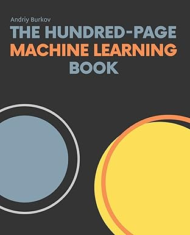{width="30%"}

[The Hundred-Page Machine Learning Book](http://ema.cri-info.cm/wp-content/uploads/2019/07/2019BurkovTheHundred-pageMachineLearning.pdf). <br/> Andriy Burkov

:::

::: column

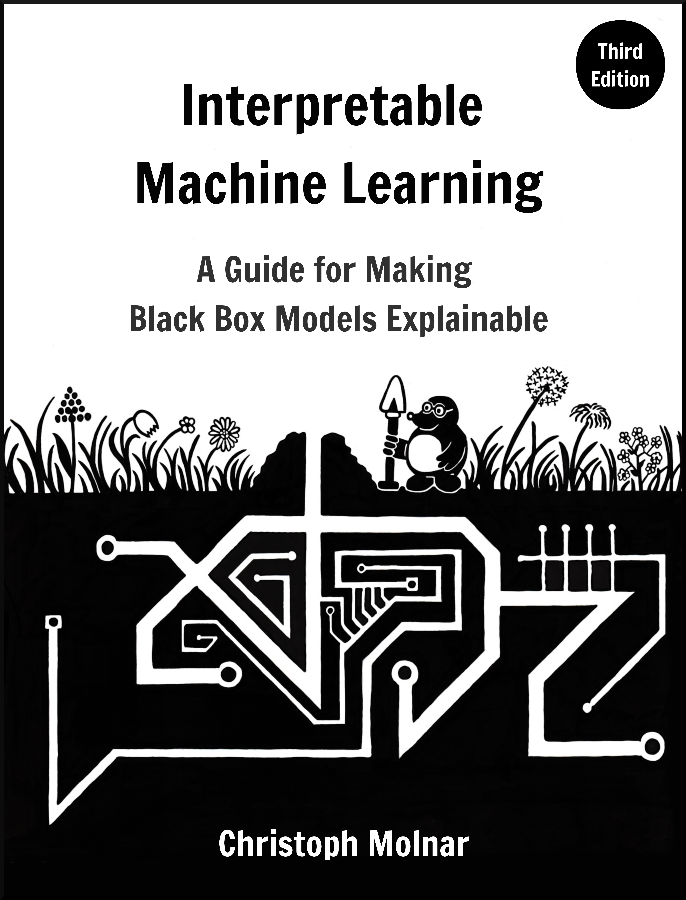{width="30%"}

[Interpretable Machine Learning](https://christophm.github.io/interpretable-ml-book/). <br/> Christoph Molnar

:::

::: column

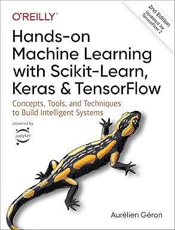{width="30%"}

[Hands-On Machine Learning with Scikit-Learn, Keras & TensorFlow](https://www.oreilly.com/library/view/hands-on-machine-learning/9781492032632/). <br/> Aurélien Géron

:::
:::

## Définitions et notations

$$
y = F_{\beta} (X)
$$

- $y$: *Observations* ou *labels*
- $F$: Règle de décision
- $\beta$: Ensemble de paramètres à estimer
- $X$: *Variables* ou *features*

$X$ et $y$ peuvent être des nombres réels, des catégories, des vecteurs, matrices, graphs etc.

## Les principaux types de modèles ML

](./img/ml_02_ScikitAlgoChoiceCheatsheet.png){width="100%"}

- **Supervisé** : on connaît les labels (régression, classification).
- **Non-supervisé** : pas de labels (clustering, réduction dimension).
- **Semi-supervisé / auto-supervisé** : hybride.
- **Deep learning** : modèles à structures neuronales profondes.


## Exemples de modèles supervisé (1)

### Les régressions linéaires (variables continues)

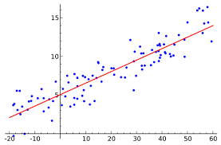{width="100%"}

- Modèle simple, interprétable : $y = \beta_0 + \beta_1 x_1 + ...$
- Hypothèse : relation linéaire entre features et output.
- Utilisation : prévisions, effets marginaux, tendances.

💡En économétrie, on se concentre sur l'estimation des $\beta$, en ML donne plus d'importance à l'estimation de $y$.


## Exemples de modèles supervisé (2)

### Les régressions logistiques (variables discrètes)

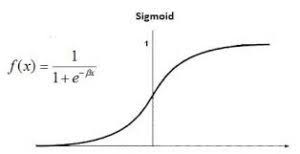{width="100%"}

- Sortie = probabilité d’appartenir à une classe.
- Décision : $p > 0.5$ → classe 1 (par défaut).
- Fonction logistique :  
  $$p = \frac{1}{1 + e^{-(\beta_0 + \beta X)}}$$
- Utilisation : scoring, détection fraude, détection mode de transport.


## Exemples de modèles non-supervisé (1)

### SVM (Support Vector Machine)

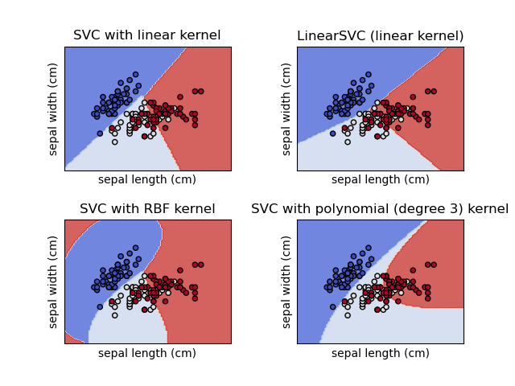{width="100%"}

- Trouve l’hyperplan séparant au mieux les classes.
- Version non supervisée : One-Class SVM (détection anomalies).
- En classification : maximise la *marge* entre classes.
- Peut être linéaire ou non-linéaire (kernel trick).


## Exemples de modèles non-supervisé (2)

### K-means

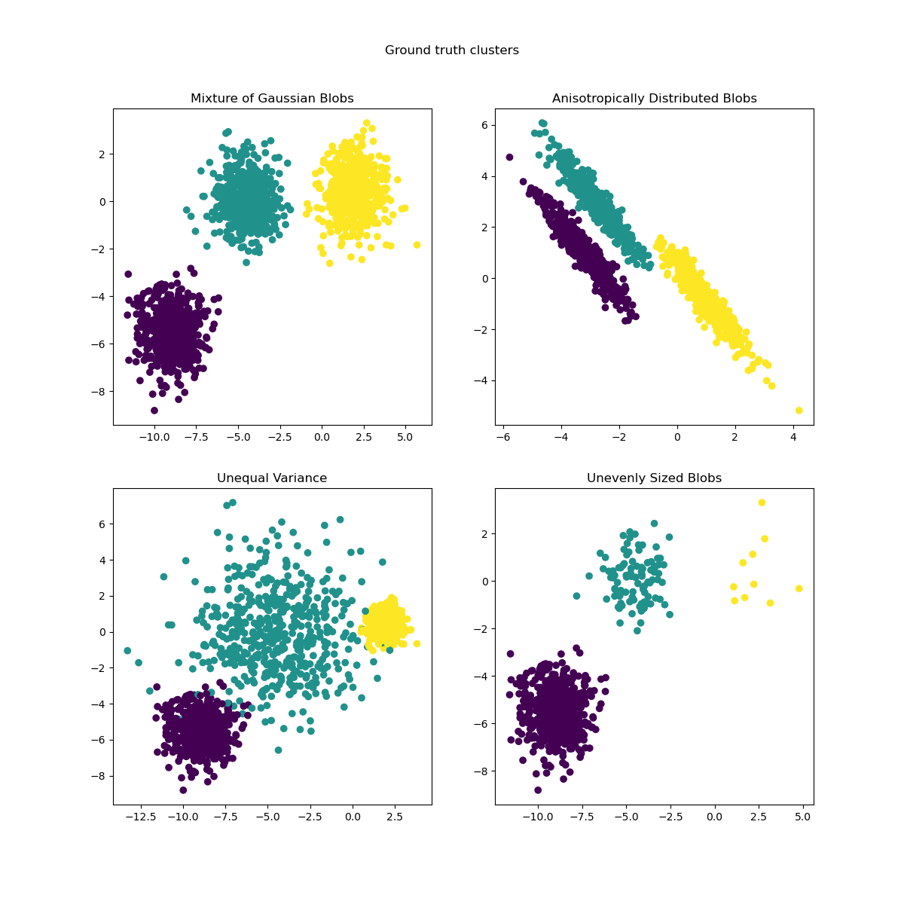{width="100%"}

- Algorithme de clustering le plus utilisé.
- Regroupe les points en K groupes en minimisant l’inertie.
- Sensible à l’échelle → standardisation recommandée.
- Utilisation : segmentation clients, analyse patterns.


## Exemples de modèles non-supervisé (3)

### KNN (K Neighrest Neighbours)

](./img/ml_knn.jpg){width="100%"}

- Classification ou régression par proximité.
- Aucune hypothèse : basé sur la distance entre points.
- Paramètre clé : K (nombre de voisins).
- Souvent utilisé comme modèle de base / benchmark.


## Exemple de modèle de Deep Learning

### Réseaux de neurones

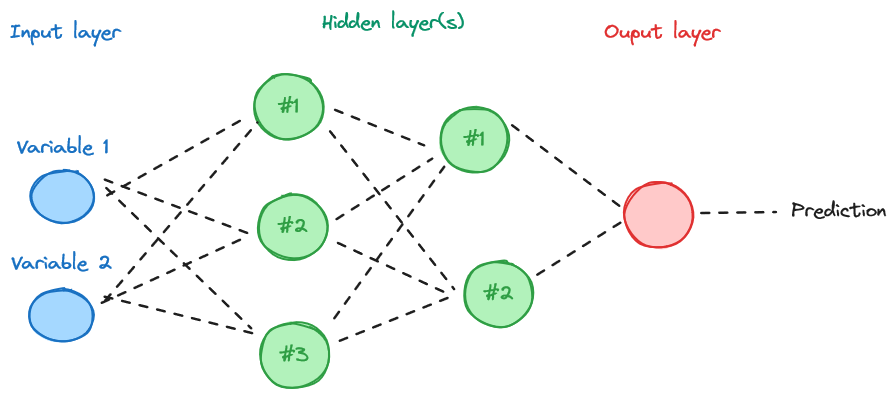{width="100%"}

- Empilement de couches : entrée → couches cachées → sortie.
- Fonction d’activation : ReLU, Sigmoid, Tanh.
- Apprentissage par rétropropagation du gradient.
- Très performant pour vision, texte, séries temporelles.

💡Modèles utilisés pour un grand volume de données, dont on ne maitrise pas a priori les attributs. Rarement adaptés dans le cas de jeux de données Open Data.

## Les différentes étapes de la modélisation

- Préparation des données (la moins valorisée mais la plus importante, ~80% du temps passé)
- Application du modèle (entraîner, ajuster paramètres).
- Évaluation : mesurer précision + robustesse.
- Itération : améliorer features, modèle, hyperparamètres.

## Étape 1 - Préparation des données

- Nettoyer : gérer valeurs manquantes / aberrantes.
- Split : train / validation / test.
- Transformer : encodage (valeurs discrètes), normalisation, scaling (valeurs continues).
- Sélectionner : réduire la dimension, garder l’essentiel.

## Étape 1 - Préparation des données

### Traitement des valeurs manquantes ou aberrantes

- Méthodes : suppression / imputation.
- Détection d’outliers : IQR, z-score, isolation forest.
- Impact : un mauvais traitement ⇒ biais important.

## Méthodes d'imputation des valeurs manquantes
 
- suppression, 
- imputation (moyenne (`mean`), médiane (`median`), valeur la plus fréquente (`most_frequent`), KNN).

*Exemple:* Classe `SimpleImputer` de `sklearn.impute`:

```python
from sklearn.impute import SimpleImputer
```

<br>

```python
import numpy as np
import pandas as pd
from sklearn.impute import SimpleImputer

# Exemple de dataset avec valeurs manquantes
data = pd.DataFrame({
    'Age': [25, 30, np.nan, 35, 40],
    'Salaire': [50000, np.nan, 60000, 70000, np.nan],
    'Sexe': ['M', 'F', 'M', np.nan, 'F']
})

# Initialisation du SimpleImputer avec la stratégie "mean"
imputer_mean = SimpleImputer(strategy='mean')

# Imputation des colonnes numériques
data[['Age', 'Salaire']] = imputer_mean.fit_transform(data[['Age', 'Salaire']])

print(f"\nDonnées après imputation des colonnes numériques (moyenne) :\n{data}")

```

## Méthodes de détection des valeurs aberrantes

- Gestion des valeurs aberrantes (outliers): observations qui se situent significativement à l’extérieur de la tendance générale des autres observations dans un ensemble de données.
- Renvoie 1 pour les résultats « normaux », -1 pour les anomalies.

*Exemple:* Classe `IsolationForest` de `sklearn.ensemble`:

```python
from sklearn.ensemble import IsolationForest
```

<br>

```python
from sklearn.ensemble import IsolationForest
import pandas as pd

# # Exemple de données:
data = pd.DataFrame({
    'Feature1': [1, 2, 2, 3, 4, 5, 100],
    'Feature2': [1, 1, 2, 2, 3, 4, 100]
})

# # Initialisation:
iso_forest = IsolationForest(contamination=0.1, random_state=42)

# # Ajustement sur les données:
iso_forest.fit(data)

# # Prédictions: -1 pour les anomalies, 1 pour les points valides
predictions = iso_forest.predict(data)

# # Score d'anomalie:
anomaly_score = iso_forest.decision_function(data)

# # Ajout du score au df:
data['anomaly'] = predictions
data['anomaly_score'] = anomaly_score

print(data)

```

## Étape 1 - Préparation des données

### Sélection des variables d'intérêt

- Approches : corrélation, ANOVA, mutual information.
- Méthodes automatiques : RFE, Lasso.
- Objectif : réduire la dimension, éviter le surapprentissage (overfitting).
- Mieux vaut une feature de qualité que 100 features inutiles.

TODO Add simple LASSO example

## Étape 1 - Préparation des données

### Séparation échantillons de test et de validation

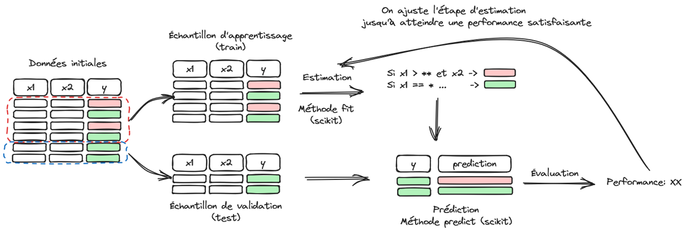

---

- Split typique : 70% train / 15% validation / 15% test.
- Objectif : mesurer la performance hors échantillon.
- Utiliser `sklearn.train_test_split`.
- Le test final ne doit jamais servir à ajuster le modèle.

Exemple d'application sur une régression linéaire:

```python
# # Séparation test / validation:
import numpy as np
import matplotlib.pyplot as plt
from sklearn.model_selection import train_test_split
from sklearn.linear_model import LinearRegression

# # 1. Génération de données synthétiques
np.random.seed(42)  # Pour reproductibilité
X = np.random.rand(100, 1) * 10  # Caractéristiques
y = 3 * X.flatten() + 5 + np.random.randn(100) * 2  # Cible avec un peu de bruit

# # 2. Division des données en ensemble d'entraînement et de test
X_train, X_test, y_train, y_test = train_test_split(X, y, test_size=0.2, random_state=42)

# # 3. Création et entraînement du modèle de régression linéaire
model = LinearRegression()
model.fit(X_train, y_train)

# # 4. Prédictions
y_pred = model.predict(X_test)

# # 5. Visualisation des résultats
plt.scatter(X_test, y_test, color='blue', label="Données réelles")
plt.plot(X_test, y_pred, color='red', label="Prédictions du modèle")
plt.title("Régression Linéaire avec Scikit-learn")
plt.legend()
plt.show()

```


## Étape 1 - Préparation des données

### Standardisation et normalisation

- **Standardisation** : centrer/réduire (moy=0, std=1).
- **Normalisation** : mise à l’échelle [0,1].
- Indispensable pour : SVM, KNN, régressions régularisées.
- Utiliser `StandardScaler`, `MinMaxScaler` (scikit-learn).

💡La standardisation et normalisation des variables permet entre autres:

-  d’assurer une échelle cohérente entre variables et d’atténuer les effets de différences de magnitudes de valeurs (ex: variable en mètres avec grande variation vs variable en kg avec petite variation)

- D’accélérer la convergence des algorithmes d’optimisation.

💡💡Les étapes de standardisation et normalisation doivent s'appliquer **après découpe** du jeu de données en un échantillon de test et un de validation.

---

- Exemple de **Standardisation**:

==> 2 étapes:

1. Création d’un *scaler* calibré sur la donnée
2. Application du *scaler* à la plage à standardiser

💡la méthode `fit_transform` de `StandardScaler()` combine les deux operations de calibrage et application.

```python
from sklearn.preprocessing import StandardScaler
```

<br>

```python
## Standardisation
import numpy as np
from sklearn.preprocessing import StandardScaler

# # Exemple de données:
X = np.array([[1, 2], [3, 4], [5, 6]])

# # Création d'un scaler:
scaler = StandardScaler()

# # Étape 1: Apprentissage
scaler.fit(X)
print(f'Moyenne: {scaler.mean_}')  # notez le ".mean_"
print(f'Écart type: {scaler.scale_}')  # notez le ".scale_"

# # Étape 2: Transformation
X_scaled = scaler.transform(X)
print(f'Données normalisées: {X_scaled}')

# # Étape combinée: apprentissage + transformation:
X_scaled_combined = scaler.fit_transform(X)
print(f'Données normalisées (fit_transform): {X_scaled_combined}')

```

---

- Exemple de **Normalisation**:

==> transformation des données de manière à obtenir une norme unitaire.

```python
from sklearn.preprocessing import Normalizer
```

<br>


```python
# # Normalisation:
from sklearn.preprocessing import Normalizer
import numpy as np

# # Exemple de données:
X = np.array([[1, 2], [3, 4], [5, 6]])

# # Instanciation du normaliseur:
normalizer = Normalizer(norm='l2')

# # Calibration sur la donnée:
normalizer.fit(X)

# # Application à la donnée:
X_normalized = normalizer.transform(X)
print(f'X_normalized:\n{X_normalized}')

```

## Étape 1 - Préparation des données

### Encodage des valeurs discrètes

==> Les données catégorielles doivent être recodées sous forme de valeurs numériques pour être intégrés aux modèles de machine learning.


- Encodage one-hot (`pd.get_dummies`, `OneHotEncoder`).
- OrdinalEncoder si ordre naturel.
- Attention au *curse of dimensionality* si trop de catégories.
- Astuce : grouper les catégories rares.

Méthode `One Hot Encoding`: ==> créer une colonne par valeur de variable catégorielle avec des 0 ou 1 en valeur.

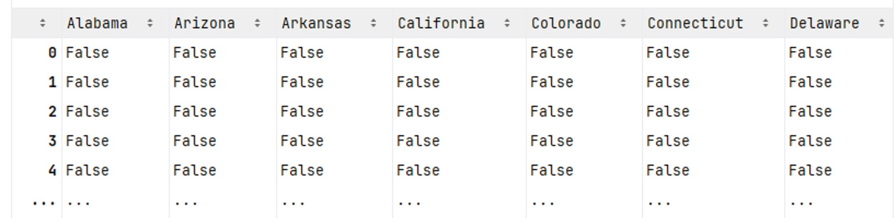{width="100%"}

---

- Exemple d'**encodage** de valeurs catégorielles:


```python
from sklearn.preprocessing import OrdinalEncoder
```

<br>


```python
# # OneHotEncoder:
from sklearn.preprocessing import OrdinalEncoder
import pandas as pd

# # Exemple de données catégorielles:
data = pd.DataFrame({
    'couleur': ['rouge', 'bleu', 'vert', 'rouge', 'bleu'],
    'taille': ['petit', 'grand', 'moyen', 'petit', 'moyen']
})

# # Instanciation du OrdinalEncoder:
ordinal_encoder = OrdinalEncoder()

# # Transformation:
encoded_data = ordinal_encoder.fit_transform(data)

print(f'Données encodées:\n{encoded_data}')
print('Mapping des catégories:')
for i, cat in enumerate(ordinal_encoder.categories_):
    print(f'\tFeature "{data.columns[i]}": {cat}')
```


## Étape 2 - Application du modèle

### Application modèle Régression Linéaire

```python
# # Regression Linéaire:
import numpy as np
import matplotlib.pyplot as plt 
from sklearn.linear_model import LinearRegression
from sklearn.model_selection import train_test_split
from sklearn.metrics import mean_squared_error, r2_score

# # 1. Génération de données synthétiques
X = np.random.rand(100, 1) * 10  # Caractéristiques
y = 3 * X.flatten() + 5 + np.random.randn(100) * 2  # Cible avec un peu de bruit

# # 2. Division des données en ensemble d'entraînement et de test
X_train, X_test, y_train, y_test = train_test_split(X, y, test_size=0.2, random_state=42)

# # 3. Création et entraînement du modèle de régression linéaire
model = LinearRegression()
model.fit(X_train, y_train)

# # 4. Prédictions
y_pred = model.predict(X_test)

# # 5. Évaluation du modèle
mse = mean_squared_error(y_test, y_pred)
r2 = r2_score(y_test, y_pred)

print(f"Erreur quadratique moyenne (MSE): {mse:.2f}")
print(f"Score R²: {r2:.2f}")

# # 6. Visualisation des résultats
plt.scatter(X_test, y_test, color='blue', label="Données réelles")
plt.plot(X_test, y_pred, color='red', label="Prédictions du modèle")
plt.xlabel("X")
plt.ylabel("y")
plt.title("Régression Linéaire avec Scikit-learn")
plt.legend()
plt.show()
```

## Étape 2 - Application du modèle

### Application modèle Régression Logistique

```python
# # Régression logistique:
import numpy as np
import matplotlib.pyplot as plt
from sklearn.datasets import make_classification
from sklearn.linear_model import LogisticRegression
from sklearn.model_selection import train_test_split
from sklearn.metrics import accuracy_score, confusion_matrix, classification_report, RocCurveDisplay

# # 1. Génération de données synthétiques
X, y = make_classification(
    n_samples=200,  # Nombre d'exemples
    n_features=2,   # Nombre de caractéristiques
    n_informative=2, # Caractéristiques pertinentes
    n_redundant=0,  # Aucune caractéristique redondante
    n_clusters_per_class=1,  # Un cluster par classe
    class_sep=2.0,  # Séparation entre les classes
    random_state=42
)

# # 2. Division des données en ensemble d'entraînement et de test
X_train, X_test, y_train, y_test = train_test_split(X, y, test_size=0.2, random_state=42)


# # 3. Création et entraînement du modèle de régression logistique
model = LogisticRegression()
model.fit(X_train, y_train)

# # 4. Prédictions
y_pred = model.predict(X_test)

# # 5. Évaluation du modèle
accuracy = accuracy_score(y_test, y_pred)
conf_matrix = confusion_matrix(y_test, y_pred)

print(f"Précision (Accuracy) : {accuracy:.2f}")
print("\nMatrice de confusion :")
print(conf_matrix)
print("\nRapport de classification :")
print(classification_report(y_test, y_pred))

# # 6. Visualisation des données et de la frontière de décision
plt.figure(figsize=(8, 6))
# # Meshgrid pour la visualisation
x_min, x_max = X[:, 0].min() - 1, X[:, 0].max() + 1
y_min, y_max = X[:, 1].min() - 1, X[:, 1].max() + 1
xx, yy = np.meshgrid(np.arange(x_min, x_max, 0.1),
                     np.arange(y_min, y_max, 0.1))
Z = model.predict(np.c_[xx.ravel(), yy.ravel()]).reshape(xx.shape)

# # Contour de la frontière de décision
plt.contourf(xx, yy, Z, alpha=0.8, cmap=plt.cm.Paired)

# # Points de données
plt.scatter(X[:, 0], X[:, 1], c=y, edgecolor='k', cmap=plt.cm.Paired)
plt.title("Régression Logistique - Frontière de Décision")
plt.xlabel("Caractéristique 1")
plt.ylabel("Caractéristique 2")
plt.show()

# # 7. Courbe ROC
RocCurveDisplay.from_estimator(model, X_test, y_test)
plt.show()

```

## Étape 3 - Évaluation de la qualité du modèle

- Dans le cas supervisé pour variables continues / discrètes
- Dans le cas non-supervisé

## Étape 3 - Évaluation de la qualité du modèle

- Différente selon type : régression, classification, clustering.
- Toujours comparer : *train* vs *validation* vs *test*.
- Surapprentissage : modèle trop complexe → mauvaise généralisation.
- Utiliser courbes d’apprentissage pour diagnostiquer.

---

### Cas supervisé -  variables continues

Attention au risque d'**Overfitting**!

Métriques appliquées = métriques des analyses de moindre carrés.

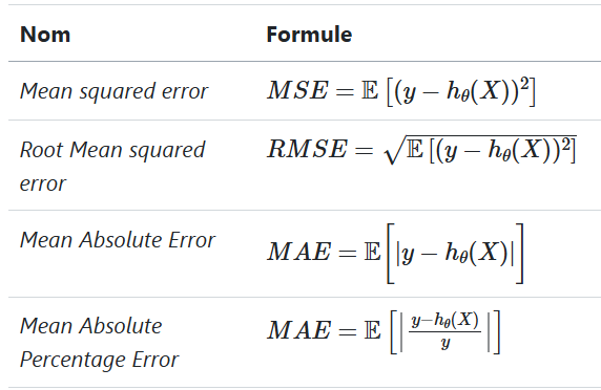{width="100%"}

---

Exemple d'analyse de qualité d'un modèle de régression **linéaire**:

```python
from sklearn.metrics import mean_squared_error, 
```

<br>

```python
import numpy as np
import matplotlib.pyplot as plt
from sklearn.model_selection import train_test_split
from sklearn.linear_model import LinearRegression
from sklearn.metrics import mean_squared_error, r2_score

# 1. Génération de données synthétiques
np.random.seed(42)  # Pour reproductibilité
X = np.random.rand(100, 1) * 10  # Caractéristiques
y = 3 * X.flatten() + 5 + np.random.randn(100) * 2  # Cible avec un peu de bruit

# 2. Division des données en ensemble d'entraînement et de test
X_train, X_test, y_train, y_test = train_test_split(X, y, test_size=0.2, random_state=42)

# 3. Création et entraînement du modèle de régression linéaire
model = LinearRegression()
model.fit(X_train, y_train)

# 4. Prédictions
y_pred = model.predict(X_test)

# 5. Évaluation du modèle
mse = mean_squared_error(y_test, y_pred)
r2 = r2_score(y_test, y_pred)

print(f"Erreur quadratique moyenne (MSE): {mse:.2f}")
print(f"Score R²: {r2:.2f}")

# 6. Visualisation des résultats
plt.scatter(X_test, y_test, color='blue', label="Données réelles")
plt.plot(X_test, y_pred, color='red', label="Prédictions du modèle")
plt.xlabel("X")
plt.ylabel("y")
plt.title("Régression Linéaire avec Scikit-learn")
plt.legend()
plt.show()

```


---

### Cas supervisé -  variables discrètes

Matrices de confusion:

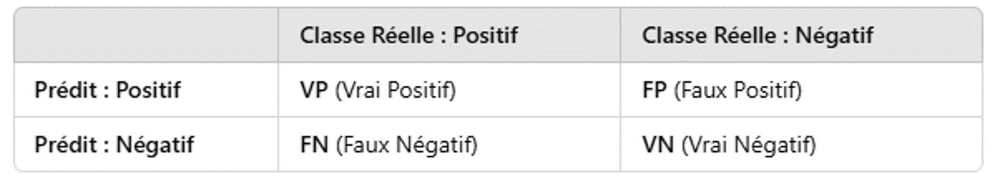{width="100%"}


| Terme                          | Définition                                                   | Formulation                                          |
|--------------------------------|--------------------------------------------------------------|------------------------------------------------------|
| Exactitude (**Accuracy**)      | Proportion de prédictions correctes                          | $𝑎𝑐𝑐=\frac{(𝑉𝑃+𝑉𝑁)}{𝑇𝑜𝑡𝑎𝑙}$                        | 
| Précision (**Precision**)          | Proportion de vrais positifs parmi tous les positifs prédits | $𝑝𝑟𝑒𝑐=\frac{𝑉𝑃}{(𝑉𝑃 + 𝐹𝑃)}$                          | 
| Rappel (**Recall**) ou Sensibilité | Proportion de vrais positifs parmi tous les positifs réels   | $𝑟𝑒𝑐=\frac{𝑉𝑃}{(𝑉𝑃+ 𝐹𝑁)}$                             | 
| **F1-Score**                       | Moyenne harmonique entre précision et rappel                 | $𝑓1_{𝑠𝑐𝑜𝑟𝑒}=2∗\frac{(𝑝𝑟𝑒𝑐 ∗𝑟𝑒𝑐)}{(𝑝𝑟𝑒𝑐+𝑟𝑒𝑐)}$ | 
| **Spécificité**                    | Proportion de vrais négatifs parmi tous les négatifs réels   | $𝑠𝑝𝑒𝑐=\frac{𝑉𝑁}{(𝑉𝑁+𝐹𝑃)}$                            |   
---

Exemple d'analyse de qualité d'un modèle de régression **logistique**:

```python
from sklearn.metrics import confusion_matrix, classification_report 
```

<br>

```python
# # Évaluer la qualité d'un modèle: régression logistique:

from sklearn.metrics import confusion_matrix, classification_report

# # Valeurs réelles et prédictions du modèle:
y_true = [1, 0, 1, 1, 0, 0, 1, 0, 1, 0]  # 1 = Spam, 0 = Non Spam
y_pred = [1, 0, 0, 1, 1, 0, 1, 0, 0, 1]

# # Génération de la matrice de confusion:
cm = confusion_matrix(y_true, y_pred)

print(f'Matrice de confusion:\n{cm}')

# # Rapport de classification (précision, rappel, F1-score)
print(f"\nRapport de classification :\n{classification_report(y_true, y_pred)}")

```


## Application

Analyse des résultats des élections US 2020.

<summary>Code complet de récupération des données:</summary>
<details>
```python
import urllib
import urllib.request
import os
import zipfile
from urllib.request import Request, urlopen
from pathlib import Path
import numpy as np
import pandas as pd
import geopandas as gpd


def download_url(url, save_path):
    with urllib.request.urlopen(url) as dl_file:
        with open(save_path, "wb") as out_file:
            out_file.write(dl_file.read())


def create_votes_dataframes():
    
    Path("data").mkdir(parents=True, exist_ok=True)

    # Backup de "https://www2.census.gov/geo/tiger/GENZ2019/shp/cb_2019_us_county_20m.zip",
    download_url(
        "https://minio.lab.sspcloud.fr/lgaliana/data/python-ENSAE/shapefile_county_us_2019.zip",
        "data/shapefile",
    )

    with zipfile.ZipFile("data/shapefile", "r") as zip_ref:
        zip_ref.extractall("data/counties")

    shp = gpd.read_file("data/counties/cb_2019_us_county_20m.shp")
    shp = shp[~shp["STATEFP"].isin(["02", "69", "66", "78", "60", "72", "15"])]
    shp

    df_election = pd.read_csv(
        "https://raw.githubusercontent.com/tonmcg/US_County_Level_Election_Results_08-20/master/2020_US_County_Level_Presidential_Results.csv"
    )
    df_election.head(2)
    population = pd.read_excel(
        "https://ers.usda.gov/sites/default/files/_laserfiche/DataFiles/48747/PopulationEstimates.xlsx?v=85724",
        header=4,
    ).rename(columns={"FIPStxt": "FIPS"})
    education = pd.read_excel(
        "https://ers.usda.gov/sites/default/files/_laserfiche/DataFiles/48747/Education.xlsx?v=34502",
        header=3,
    ).rename(columns={"FIPS Code": "FIPS", "Area name": "Area_Name"})
    unemployment = pd.read_excel(
        "https://ers.usda.gov/sites/default/files/_laserfiche/DataFiles/48747/Unemployment.xlsx?v=35579",
        header=4,
    ).rename(columns={"FIPS_Code": "FIPS", "area_name": "Area_Name", "Stabr": "State"})
    income = pd.read_excel(
        "https://ers.usda.gov/sites/default/files/_laserfiche/DataFiles/48747/PovertyEstimates.xlsx?v=36737",
        header=4,
    ).rename(columns={"FIPS_Code": "FIPS", "Stabr": "State", "Area_name": "Area_Name"})

    dfs = [
        df.set_index(["FIPS", "State"])
        for df in [population, education, unemployment, income]
    ]
    data_county = pd.concat(dfs, axis=1)
    df_election = df_election.merge(
        data_county.reset_index(), left_on="county_fips", right_on="FIPS"
    )
    df_election["county_fips"] = df_election["county_fips"].astype(str).str.lstrip("0")
    shp["FIPS"] = shp["GEOID"].astype(str).str.lstrip("0")
    votes = shp.merge(df_election, left_on="FIPS", right_on="county_fips")

    req = Request(
        "https://dataverse.harvard.edu/api/access/datafile/3641280?gbrecs=false"
    )
    req.add_header(
        "User-Agent",
        "Mozilla/5.0 (X11; Ubuntu; Linux x86_64; rv:77.0) Gecko/20100101 Firefox/77.0",
    )
    content = urlopen(req)
    df_historical = pd.read_csv(content, sep="\t")
    # df_historical = pd.read_csv('https://dataverse.harvard.edu/api/access/datafile/3641280?gbrecs=false', sep = "\t")

    df_historical = df_historical.dropna(subset=["FIPS"])
    df_historical["FIPS"] = df_historical["FIPS"].astype(int)
    df_historical["share"] = (
        df_historical["candidatevotes"] / df_historical["totalvotes"]
    )
    df_historical = df_historical[["year", "FIPS", "party", "candidatevotes", "share"]]
    df_historical["party"] = df_historical["party"].fillna("other")

    df_historical_wide = df_historical.pivot_table(
        index="FIPS", values=["candidatevotes", "share"], columns=["year", "party"]
    )
    df_historical_wide.columns = [
        "_".join(map(str, s)) for s in df_historical_wide.columns.values
    ]
    df_historical_wide = df_historical_wide.reset_index()
    df_historical_wide["FIPS"] = df_historical_wide["FIPS"].astype(str).str.lstrip("0")
    votes["FIPS"] = votes["GEOID"].astype(str).str.lstrip("0")
    votes = votes.merge(df_historical_wide, on="FIPS")
    votes["winner"] = np.where(
        votes["votes_gop"] > votes["votes_dem"], "republican", "democrats"
    )

    return votes
```
</details>

### Exercice 1: Révisions `Pandas`

```python
!pip install --upgrade xlrd
!pip install geopandas
```

[Détail des questions](https://pythonds.linogaliana.fr/content/modelisation/0_preprocessing.html#:~:text=Exercice%201%20(optionnel))


#### Récupération des données si pas d'exercice 1:

```python
import requests

url = 'https://raw.githubusercontent.com/linogaliana/python-datascientist/main/content/modelisation/get_data.py'
r = requests.get(url, allow_redirects=True)
open('getdata.py', 'wb').write(r.content)

import getdata
votes = getdata.create_votes_dataframes()
```


---

[TD 06](./06_ML_session2.html)
