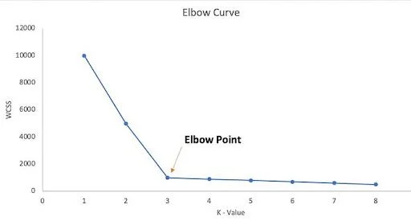
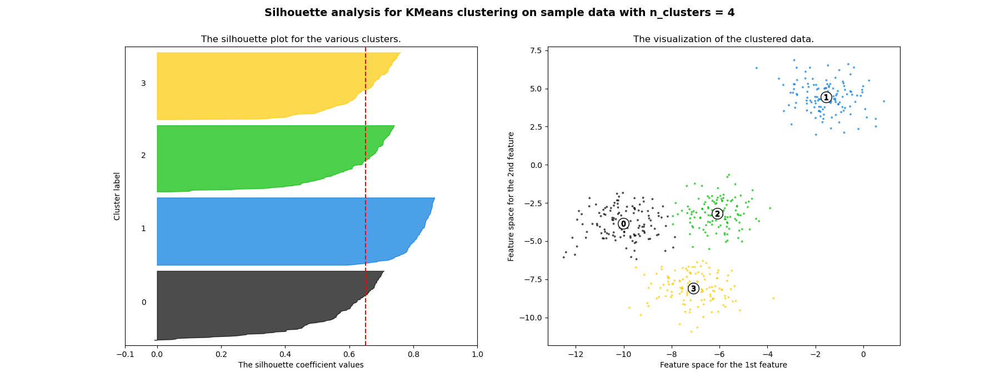

## Intro

- Évaluation de la qualité d'un modèle dans le cas non supervisé
- Pipelines
- Exercices

## Qualité d'un modèle non supervisé

- Méthode du coude
- Score de silhouette

## Méthode du coude

==> Permet de déterminer le nombre optimal de clusters *k* dans des méthodes comme `K-means`.
La méthode du coude analyse comment varie l’inertie (ou “within-cluster sum of squares”: `WCSS`) en fonction de *k*.

$$
WCSS_k = \sum_{i \in C_k}{(x_i - \mu_k)^2}
$$
avec :

- $x_i$ points du cluster $k$
- $\mu_k$ centroid du cluster $k$

---

Quand on augmente $k$, le `WCSS` diminue en passant (parfois!) par un point d'inflexion. Le nombre de clusters idéal se trouve à ce point d'inflextion.




## Score de silhouette

Le score de silhouette mesure à quel point chaque point est:

- bien regroupé avec les points de son cluster
- bien séparé des autres clusters

Pour chaque point $i$ on calcule :

- $a(i)$ = distance moyenne entre $i$ et les autres points de son propre cluster
- $b(i)$ = distance moyenne entre $i$ et les points du cluster le plus proche auquel il n’appartient pas.

Le score silhouette du point est :

$$
s(i)= \frac{b(i)−a(i)}{max(a(i),b(i))} \in [-1, 1]
$$​

Puis on fait la moyenne sur tous les points.

---

Interprétation:

| Score silhouette | 	Interprétation |
| --- | --- |
| ≈ +1 | 	Les clusters sont très bien séparés et compacts, excellent clustering | 
| ≈ 0	 | Les clusters se chevauchent, séparation faible | 
| < 0	 | Mauvaise assignation : les points sont trop proches d’un autre cluster que du leur | 

## Lire un score de silhouette


[source](https://scikit-learn.org/stable/auto_examples/cluster/plot_kmeans_silhouette_analysis.html?utm_source=chatgpt.com)


* Barre verticale rouge représente le score moyen pour l'ensemble des clusters
* Chaque couleur représente un cluster
* Chaque barre horizontale représente un point
* Longueur de la barre = score de silhouette du point
* Barres classées du plus faible score au plus grand

```python
!pip install yellowbrick # pour la visualisation des scores
```

## Pipelines

```python
from sklearn.pipeline import Pipeline
```

Les pipelines permettent de chainer des traitements de ML (`imputation`, `standardisation`, `calibration`, `application`, `tests` etc.) et de simplifier la mise en production du code. Ils permettent notamment une meilleure:

* lisibilité
* modularité
* reproductibilité

## Exercices

---

[TD 07](./07_NLP.html)
