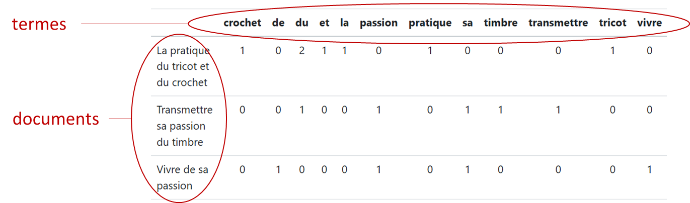
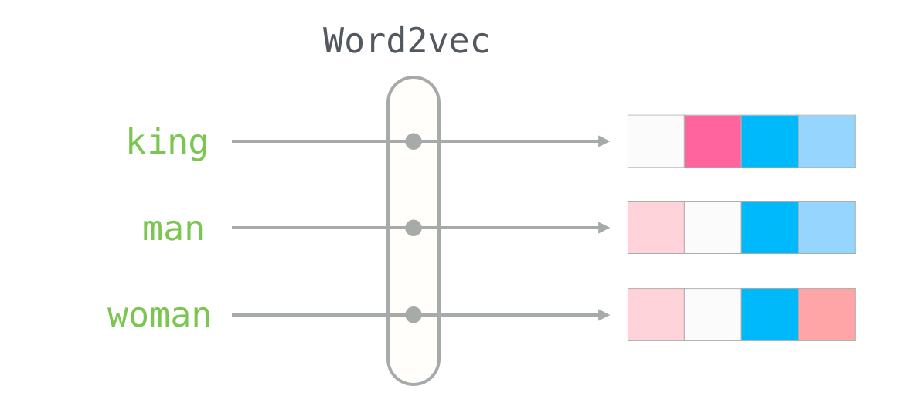
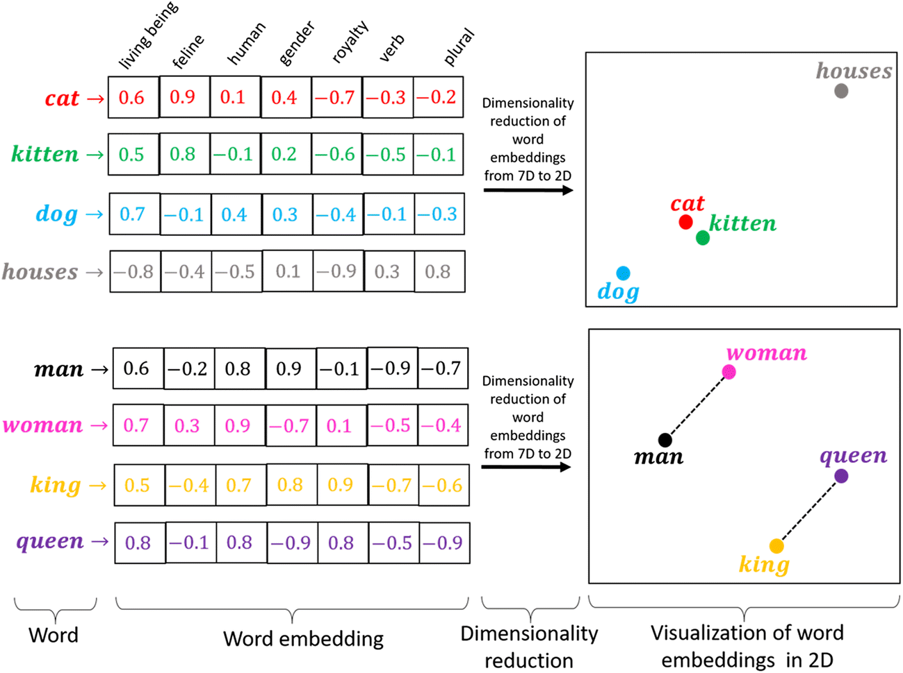

## Intro

`NLP`: méthodes à la base des `LLM` (Large Language Models) tels que `GPT` (OpenAI) our `BERT` (Google)

* Nettoyage des données textuelles
* Modélisation du langage:
  - Approche fréquentiste
  - Intro aux *Embeddings*

💡Le traitement des données textuelles est une des applications pour lesquelles `Python` est mieux outillé que `R`.

💡💡Pour aller plus loin:

- [Cours huggingface](https://huggingface.co/learn/nlp-course/chapter1/2?fw=pt)
- [Architecture interne d’un LLM](https://magazine.sebastianraschka.com/p/understanding-encoder-and-decoder)
- [Créez votre propre chatbot](https://www.deeplearning.ai/short-courses/langchain-chat-with-your-data/) 


```python
!pip install spacy        # NLP (`!pip install nltk` pour NLTK)
!pip install plotnine     # visualisations
!pip install great_tables # visualisations
!pip install wordcloud    # visualisations
!python -m spacy download en_core_web_sm
!python -m spacy download fr_core_news_sm
```

## Nettoyage

### Défis:

Les données textuelles sont par nature:

- *bruitées* : orthographe, fautes de frappe…
- *changeantes* : la langue évolue avec de nouveaux mots, sens…
- *complexes* : structures variables, accords…
- *ambiguës* : synonymie, polysémie, sens caché…
- *propres à chaque langue* : il n’existe pas de règle de passage unique entre deux langues.
- *de grande dimension* : des combinaisons infinies de séquences de mots.

## Outils de modélisation des données textuelles

- `NLTK`: Librairie historique mais limitée

```
pip install nltk
```

- `Spacy`: Plus moderne et plusa adaptées aux languages non anglo-saxons

```
pip install spacy
```


## Méthodes

Transformation de données textuelles en données numériques décomposabes en unités sémantiques minimales: les `tokens`.

Exemples du cours basés sur les oeuvres:

- Le comte de Monte Cristo (Alexandre Dumas)
- Diverses oeuvres de Allan Poe, Mary Shelley et H.P. Lovecraft.

## Téléchargement des oeuvres

### Dumas

```python
import requests

url = "https://www.gutenberg.org/files/17989/17989-0.txt"
response = requests.get(url)
response.encoding = 'utf-8'  # Assure le bon décodage
raw = response.text

dumas = (
  raw
  .split("*** START OF THE PROJECT GUTENBERG EBOOK 17989 ***")[1]
  .split("*** END OF THE PROJECT GUTENBERG EBOOK 17989 ***")[0]
)


def clean_text(text):
    text = text.lower() # mettre les mots en minuscule
    text = " ".join(text.split())
    return text

dumas = clean_text(dumas)

dumas[10000:10500]
```

---

### Corpus anglo-saxon

```python
import pandas as pd

url='https://github.com/GU4243-ADS/spring2018-project1-ginnyqg/raw/master/data/spooky.csv'
#1. Import des données
horror = pd.read_csv(url,encoding='latin-1')
#2. Majuscules aux noms des colonnes
horror.columns = horror.columns.str.capitalize()
#3. Retirer le prefixe id
horror['ID'] = horror['Id'].str.replace("id","")
horror = horror.set_index('Id')
horror.head()
```

---

### Exercices analyses fréquentistes basiques

[Exercices analyses de fréquence basiques](https://pythonds.linogaliana.fr/content/NLP/01_intro.html#:~:text=Exercice%201%20%3A%20Fr%C3%A9quence%20d%E2%80%99un%20mot)

💡Vous pouvez ne faire que les exemples basés sur `spacy` et laisser `NLTK` de côté.


## Analyses fréquentistes `bags-of-words`

* Mesure `TF-IDF` (Term Frequency – Inverse Document Frequency) ==> création d’une **matrice documents – termes**.



---


* `TF`: fréquence d'un terme dans un document donné:

$$
tf(t, d) = \frac{f_{t,d}}{\sum_{t'\in d}f_{t',d}}
$$

* `IDF`: Indice de rareté du termes sur l'ensemble des documents.

$$
idf(t, D) = log(\frac{N}{|{d \in D: t \in d}|})
$$

---

### Exercices `bags-of_words`

```python
!pip install spacy
!python -m spacy download en_core_web_sm
!python -m spacy download fr_core_news_sm
```

<br/>

```python
def clean_text(doc):
    # Tokenize, remove stop words and punctuation, and lemmatize
    cleaned_tokens = [token.lemma_ for token in doc if not token.is_stop and not token.is_punct]
    # Join tokens back into a single string
    cleaned_text = ' '.join(cleaned_tokens)
    return cleaned_text
```

[Exercice](https://pythonds.linogaliana.fr/content/NLP/02_exoclean.html#:~:text=Exercice%201%20%3A%20TF%2DIDF%20%3A%20calcul%20de%20fr%C3%A9quence)


## Embddings

Représentations du langage au fondement des modèles de langage actuels utilisés par des outils entrés dans notre quotidien (`DeepL`, `ChatGPT`…).

### Modèle `Word2Vec`

==> Représentation synthétique du language. Permet de passer de 60 000 mots dans la langue française à environ 300 concepts.


[source](https://jalammar.github.io/illustrated-word2vec/)

---

### Réduction de la dimension


[source](https://medium.com/@hari4om/word-embedding-d816f643140)

💡L'approche `Word2Vec` permet un transfert entre les langues de même racine.

[Exercice](https://pythonds.linogaliana.fr/content/NLP/03_embedding.html#:~:text=un%20autre%20corpus.-,Astuce,Exercice%203,-R%C3%A9ponse%20%C3%A0%20la)

---

[Index cours](../index.html)
